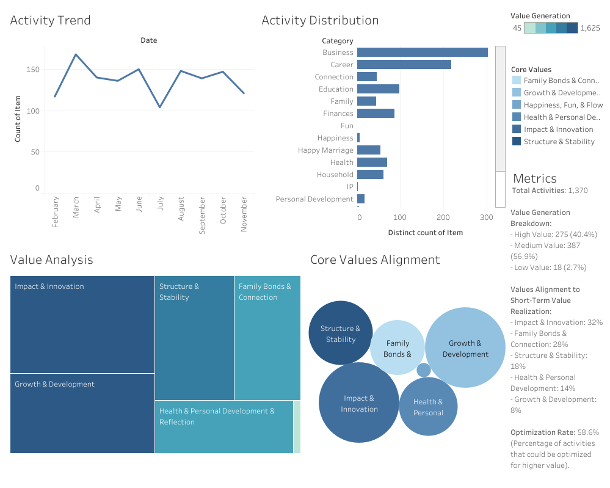
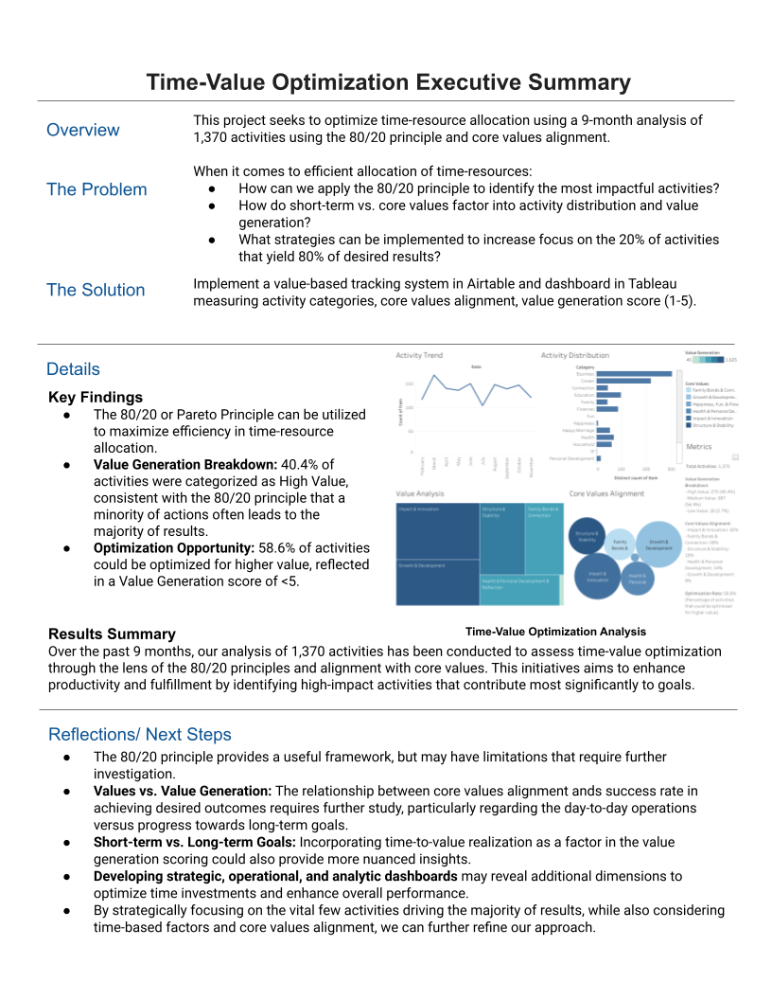
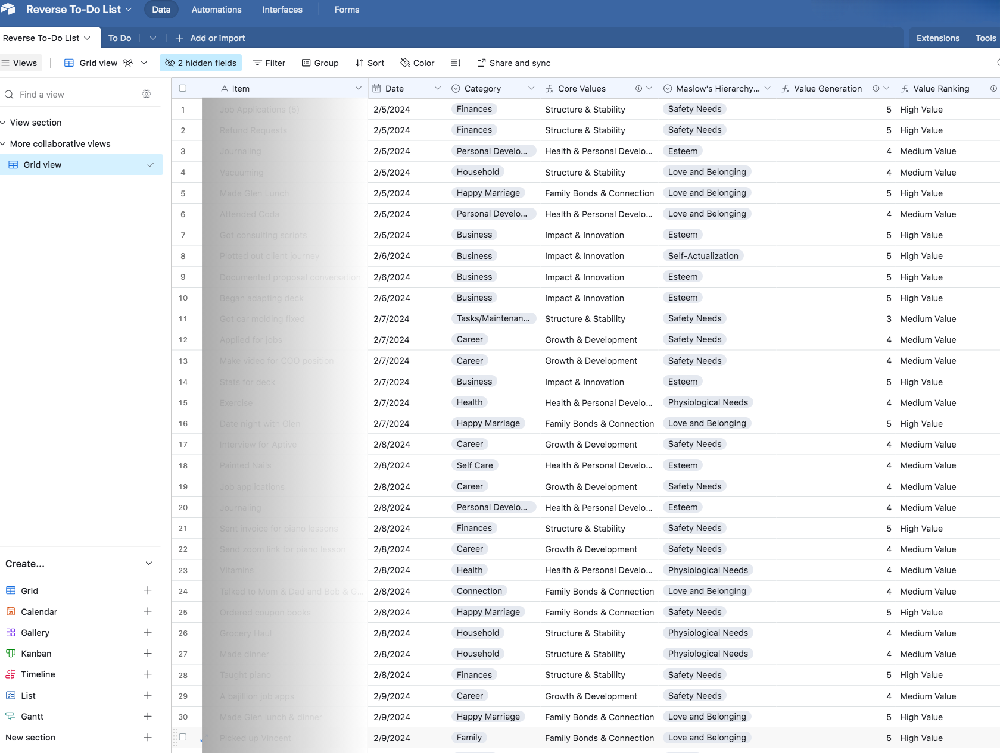

# Time-Value Optimization Analysis Using 80/20 Principle

**Data-Driven Activity Analysis for Maximum Impact**  
Analysis of 9 months of activity data (February-November 2024) to optimize time-resource allocation and value generation.

### [Live Dashboard](https://public.tableau.com/app/profile/melissa.slawsky1925/viz/Time-ValueOptimizationDashboard/Dashboard)

---

## Executive Summary & Key Findings

---

### Strategic Insights: 

Our analysis revealed opportunities to optimize time-resource allocation, but also highlighted the need to balance short-term and long-term priorities, as well as align activities with core organizational values.
1. **Value-Time Alignment**
   - Time-to-Value Realization: Activities that are on the cusp of realizing key short-term goals may warrant higher weighting, even if they do not maximize the 80/20 principle in isolation.
   - Efficiency Opportunity: With an optimization rate of 58.6%, there is potential to enhance the overall value generated by activities through more nuanced prioritization.

2. **Core Values Alignment**
   - 32% alignment with primary values like Impact & Innovation
   - 28% alignment with secondary values such as Family Bonds & Connection
   - The relationship between core values alignment and success in achieving desired outcomes requires deeper investigation, especially regarding day-to-day operations versus progress towards long-term strategic goals.

3. **Resource Allocation Patterns**
   - Pareto Distribution: 23% of activities are responsible for generating the majority of value. However, this distribution may oversimplify the need to balance maintenance and growth-oriented tasks.
   - Opportunity Costs: Misalignment between maintenance and growth activities could lead to significant opportunity costs that are not captured by the 80/20 principle alone.
   - Further analysis is required to investigate the relationship between core values and value generation towards a destination or goal. Additionally, more future data collection will differentiate between near term and long-term goals.

### Impact Analysis
- Target: Optimize impact by aligning 80% of value with 20% of activities
- Current State: 23% activities generating 80% value
- Gap Analysis: Enhancing impact will require a more holistic approach that considers time-to-value, core values, and the balance between short-term and long-term priorities.

---

## Methodology

### Data Collection Framework
- Duration: 9 months (Feb-Nov 2024)
- Activities Tracked: 1370 total
- Classification System:
  - Activity Categories
  - Core Values Alignment
  - Maslow's Hierarchy Integration
  - Value Generation Metrics
 
## Airtable Time-Value Tracking
 
  

  ---
## Tableau Visualization Methods

**1. Activity Trend**

Visualization Type: Line Graph
This visualization displays the average activity tracked on a month-to-month basis. It provides insight into trends over time, helping users identify patterns of engagement and periods of high or low activity. The x-axis represents the months, and the y-axis shows the average activity count.

**2. Activity Distribution**

Visualization Type: Horizontal Bar Graph
This chart represents the distribution of activities across different categories. Each bar corresponds to a category, and the length of the bar indicates the number of times that category appears in the dataset. This visualization helps in understanding which categories dominate or are underrepresented in the data.

**3. Value Analysis**

Visualization Type: Tree Map
The tree map illustrates the distribution of activities by core values, providing a clear visual representation of the relative frequency of activities aligned with each value. Larger blocks represent higher frequencies, offering a quick snapshot of where activities contribute most to overarching values.

**4. Core Values Alignment**

Visualization Type: Bubble Chart
This chart highlights the proportion of activities that align with core values. Each bubble represents a core value, with the size of the bubble proportional to the frequency of activities aligned with that value. It visually emphasizes which core values are most frequently integrated into tracked activities.

**5. Metrics**

Visualization Type: Text Table
A text-based metrics box provides a breakdown of activities by:

- Value Generation: Activities categorized as High, Medium, or Low value.
- Core Values vs. Short-Term Value Generation: The balance between activities aligned with long-term core values and those that prioritize short-term gains.
- Optimization Rate: A percentage reflecting the alignment of high-value activities with core values.

This text summary complements the visualizations by offering precise numeric insights for deeper understanding.

  ---

  ## Contact 📧
- [Tableau Portfolio](https://public.tableau.com/app/profile/melissa.slawsky1925/vizzes)
- [Client Results](https://melissaslawsky.com/client-results/)
- [Email](mailto:melissa@melissaslawsky.com)

---
© Melissa Slawsky 2025. All Rights Reserved.
 
---
