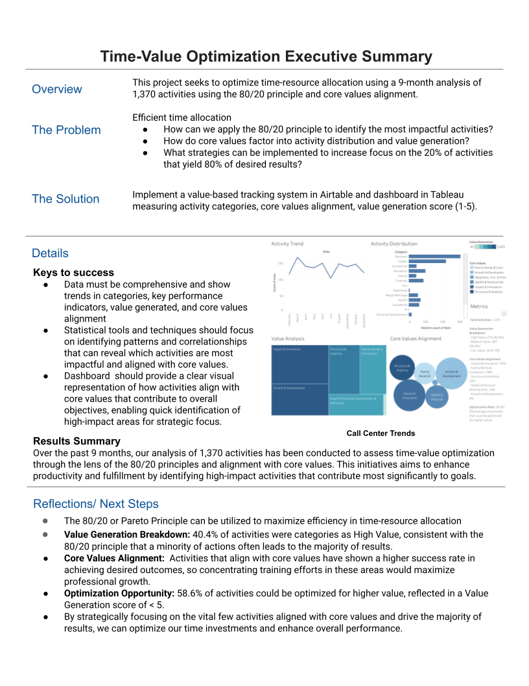

# Time-Value Optimization Analysis Using 80/20 Principle

**Data-Driven Activity Analysis for Maximum Impact**  
Analysis of 9 months of activity data (February-November 2024) to optimize time-resource allocation and value generation.

### [Live Dashboard](https://public.tableau.com/app/profile/melissa.slawsky1925/viz/Time-ValueOptimizationDashboard/Dashboard)

---

## Executive Summary & Key Findings

---

### Strategic Insights: The 80/20 Principle in Action

Our analysis revealed optimization opportunities aligned with the Pareto Principle:
1. **Value-Time Misalignment**
   - High-Value Activities: 40.4% of activities (275 out of 1,370) are classified as high-value. However, there is a need to assess whether these activities are truly generating the expected value, as the optimization rate suggests room for improvement.
   - Efficiency Opportunity: With an optimization rate of 58.6%, there is significant potential to enhance the value generated by these activities through better time allocation and prioritization.
   - Opportunity for 35% efficiency improvement

2. **Resource Allocation Patterns**
   - Pareto Distribution: While 23% of activities are responsible for generating the majority of value, there remains a critical opportunity to refine resource allocation between maintenance and growth-oriented tasks to minimize opportunity costs.
   - Critical misalignment in maintenance vs. growth activities
   - Significant opportunity costs identified

3. **Core Values Analysis**
   - 32% alignment with primary values such as Impact & Innovation
   - 28% alignment with secondary values like Family Bonds & Connection
   - 40% of activities may require realignment to better reflect core values and organizational priorities

### Impact Analysis
- Target: Optimize 80% impact from 20% activities
- Current State: 23% activities generating 80% value
- Gap Analysis:There is a significant opportunity to enhance overall impact by focusing on optimizing the high-value segment and ensuring alignment with core values.

---

## Methodology

### Data Collection Framework
- Duration: 9 months (Feb-Nov 2024)
- Activities Tracked: 651 total
- Classification System:
  - Activity Categories
  - Action Types
  - Maslow's Hierarchy Integration
  - Value Generation Metrics
 
---
